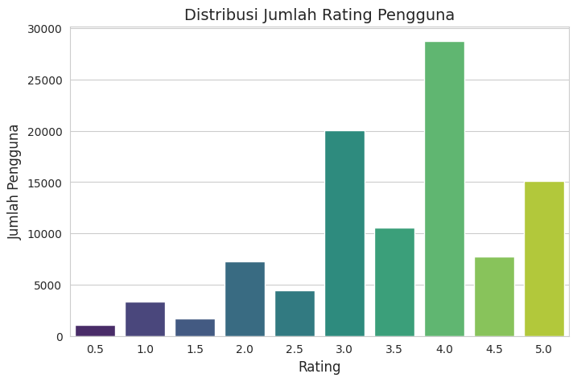
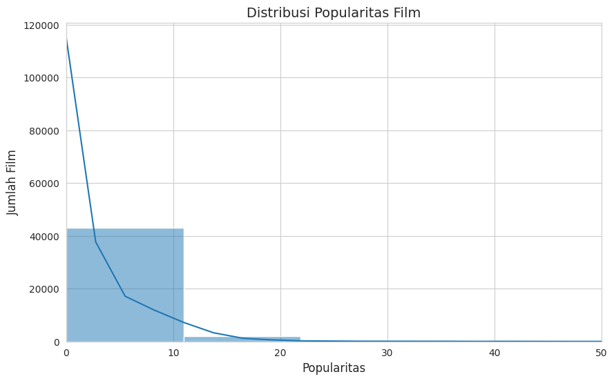
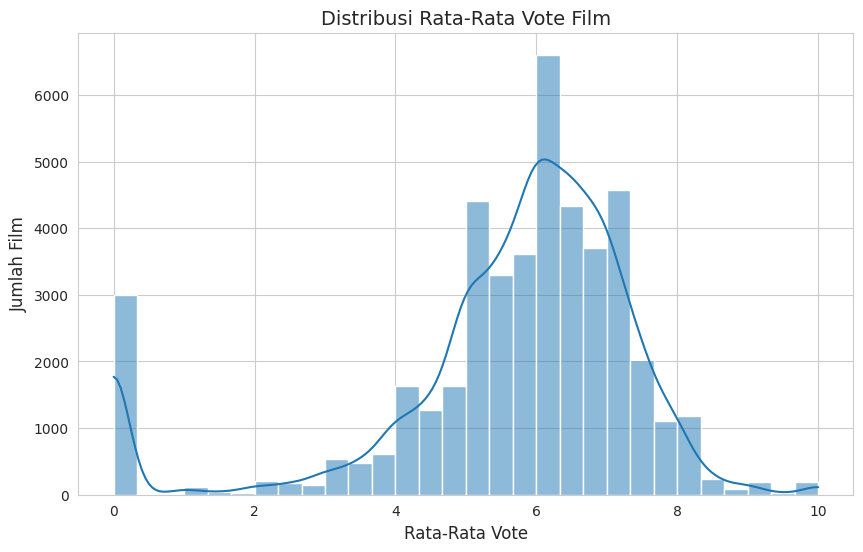
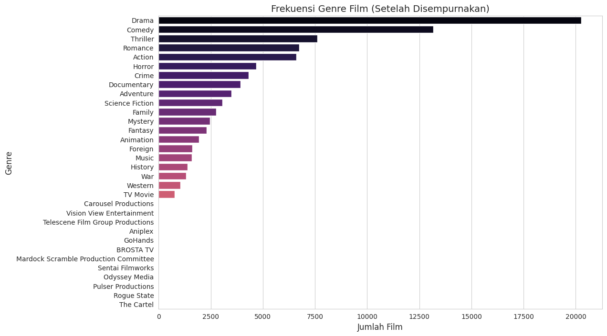
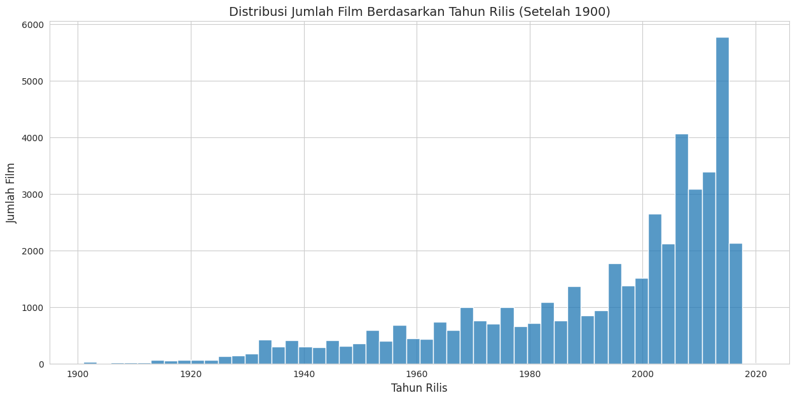
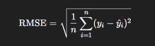
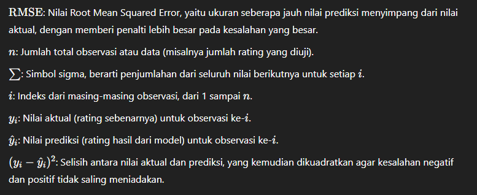
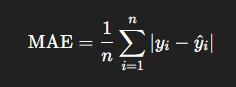
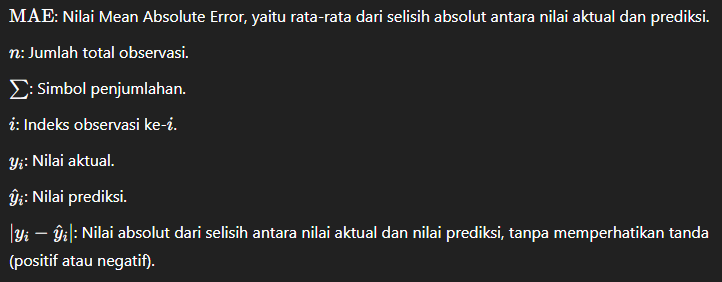

# Laporan Proyek Machine Learning Terapan 2 - Recommendation System - Zidan Muhammad Ikvan

## Project Overview

Era digital saat ini ditandai dengan ledakan informasi dan ketersediaan konten yang melimpah, khususnya dalam industri hiburan seperti perfilman. Platform streaming modern seperti Netflix, Amazon Prime Video, Disney+, serta basis data film ekstensif seperti IMDb dan The Movie Database (TMDB), menyajikan puluhan ribu hingga jutaan judul film kepada penggunanya. Meskipun keragaman ini menawarkan pilihan yang luas, ia juga menghadirkan tantangan signifikan bagi pengguna yang dikenal sebagai information overload atau "beban informasi berlebih". Pengguna seringkali merasa kewalahan dan kesulitan untuk menemukan film yang benar-benar sesuai dengan selera dan preferensi unik mereka di tengah lautan konten yang begitu besar. Akibatnya, pengguna bisa menghabiskan banyak waktu hanya untuk mencari, atau akhirnya kembali menonton konten yang sudah familiar, bahkan meninggalkan platform karena frustrasi.

Untuk mengatasi permasalahan ini, Sistem Rekomendasi (Recommender Systems) hadir sebagai solusi teknologi yang krusial. Sistem rekomendasi adalah perangkat lunak cerdas yang dirancang untuk menyaring informasi dan memprediksi preferensi pengguna, dengan tujuan menyajikan item yang paling mungkin diminati oleh pengguna tertentu. Sistem ini tidak hanya membantu pengguna menemukan konten yang relevan, tetapi juga memberikan nilai signifikan bagi platform penyedia konten.

**Jelaskan mengapa dan bagaimana masalah tersebut harus diselesaikan?**

1. **Meningkatkan Pengalaman Pengguna (User Experience)**

  Dengan menyediakan saran film yang dipersonalisasi dan relevan, sistem rekomendasi secara drastis mengurangi waktu dan upaya yang dibutuhkan pengguna untuk menemukan tontonan yang menarik. Hal ini tidak hanya meningkatkan kepuasan pengguna tetapi juga membantu mereka menemukan film-film baru atau niche yang mungkin tidak akan mereka temukan sendiri, sehingga memperkaya pengalaman menonton mereka.

2. **Nilai Bisnis bagi Platform Digital**

  Bagi platform streaming atau penyedia konten film, sistem rekomendasi yang efektif merupakan aset strategis. Sistem ini terbukti mampu meningkatkan metrik bisnis utama seperti user engagement (waktu yang dihabiskan pengguna di platform), retensi pengguna (mencegah pengguna beralih ke platform lain), dan diversifikasi konsumsi konten (mengarahkan pengguna ke berbagai jenis film, bukan hanya blockbuster). Sebagai contoh, Netflix secara terbuka menyatakan bahwa sebagian besar konten yang ditonton oleh penggunanya berasal dari hasil rekomendasi sistem mereka. Demikian pula, platform besar lainnya seperti YouTube dan Amazon sangat mengandalkan sistem rekomendasi untuk mendorong interaksi dan penjualan.
3. **Pemahaman Mendalam tentang Teknologi Kunci**

  Merancang dan mengimplementasikan sistem rekomendasi memberikan pemahaman praktis yang mendalam mengenai berbagai teknik analisis data dan machine learning. Proyek ini secara khusus akan mengeksplorasi dua pendekatan fundamental, yaitu Content Based Filtering (CBF) dan Collaborative Filtering (CF).

## Business Understanding

### Problem Statements

Menjelaskan pernyataan masalah:
- **Kesulitan Pengguna dalam Menemukan Film yang Sesuai di Tengah Keterlimpahan Pilihan (Information Overload)**

  Pengguna seringkali dihadapkan pada katalog film yang sangat besar di berbagai platform digital dan basis data. Akibatnya, pengguna mengalami kesulitan dan membutuhkan waktu lama untuk mencari dan menemukan film yang benar-benar sesuai dengan preferensi unik dan selera pribadi mereka. Hal ini dapat mengurangi kepuasan pengguna dan potensi penemuan konten baru yang menarik.

- **Kurangnya Personalisasi dalam Pengalaman Menonton Film**

  Tanpa sistem yang mampu memahami dan beradaptasi dengan selera individu, pengguna mungkin hanya disuguhkan rekomendasi film yang bersifat generik, berdasarkan popularitas umum, atau bahkan tidak relevan sama sekali. Pengalaman menonton yang kurang personal ini dapat menurunkan tingkat keterlibatan (engagement) pengguna dengan platform dan mengurangi nilai yang dirasakan dari layanan tersebut.

### Goals

Menjelaskan tujuan proyek yang menjawab pernyataan masalah:
- **Menyederhanakan Proses Penemuan Film dan Menyajikan Konten yang Relevan bagi Pengguna**

  Proyek ini bertujuan untuk mengembangkan sebuah sistem yang dapat membantu pengguna mengatasi information overload dengan cara menyaring dan menyajikan daftar film yang dipersonalisasi dan relevan. Dengan demikian, diharapkan dapat mengurangi waktu pencarian pengguna dan meningkatkan kemungkinan mereka menemukan film yang akan dinikmati.

- **Menciptakan Pengalaman Pengguna yang Lebih Personal dan Meningkatkan Keterlibatan Pengguna**

  Proyek ini bertujuan untuk membangun sistem rekomendasi yang mampu memberikan saran film yang secara spesifik disesuaikan dengan riwayat preferensi dan karakteristik masing-masing pengguna. Tujuannya adalah untuk meningkatkan engagement pengguna dengan platform melalui penyajian konten yang terasa lebih personal dan memuaskan.


  ### Solution statements
  - **Content Based Filtering**

  Pendekatan ini merekomendasikan film berdasarkan kemiripan fitur atau atribut konten dari film itu sendiri. Fitur-fitur yang dianalisis meliputi sinopsis (overview), tagline, genre, kata kunci (keywords), sutradara, dan aktor utama. Dengan menganalisis film-film yang pernah disukai pengguna atau film tertentu yang menjadi input, sistem akan mencari film lain dengan karakteristik konten serupa.

  Content-Based Filtering (CBF) membantu pengguna menemukan film baru yang relevan dengan preferensi mereka dengan menganalisis kesamaan tema, gaya, atau elemen konten dari film yang sebelumnya mereka sukai. Pendekatan ini menyederhanakan proses pencarian dengan menyajikan pilihan yang aman dan kontekstual, serta tetap mampu memberikan personalisasi meskipun tanpa bergantung pada riwayat interaksi pengguna lain, melainkan berdasarkan profil preferensi konten pengguna itu sendiri.

  - **Collaborative filtering**

  Pendekatan ini bekerja berdasarkan prinsip "kebijaksanaan orang banyak" (wisdom of the crowd). Collaborative Filtering menganalisis pola perilaku (rating) dari sejumlah besar pengguna untuk mengidentifikasi kesamaan preferensi. Algoritma SVD, sebagai teknik faktorisasi matriks, digunakan untuk menemukan faktor-faktor laten yang merepresentasikan karakteristik pengguna dan film dari data rating historis.

  Collaborative Filtering (CF), khususnya menggunakan pendekatan SVD, mampu memberikan rekomendasi yang mengejutkan namun relevan (serendipity) dengan tidak terbatas pada kesamaan konten eksplisit, melainkan berdasarkan preferensi pengguna lain yang serupa. Pendekatan ini merupakan inti dari personalisasi berbasis perilaku, karena sistem belajar dari pola interaksi pengguna dan pengguna sejenis untuk memprediksi film yang kemungkinan besar disukai, sehingga menciptakan pengalaman menonton yang personal dan meningkatkan keterlibatan.

## Data Understanding

Dataset utama yang digunakan adalah "The Movies Dataset", sebuah koleksi data yang kaya dan komprehensif mengenai film, yang mencakup metadata, rating pengguna, kata kunci, serta informasi kredit pemain dan kru. Dataset ini tersedia secara publik dan merupakan sumber populer untuk penelitian dan pengembangan sistem rekomendasi. Untuk proyek ini, dataset diperoleh dari platform Kaggle:
[The Movies Dataset - Kaggle](https://www.kaggle.com/datasets/rounakbanik/the-movies-dataset)

Dari keseluruhan dataset, lima file CSV utama menjadi fokus dalam proyek ini: movies_metadata.csv, ratings_small.csv, keywords.csv, credits.csv, dan links_small.csv. Pemeriksaan awal pada data ini menunjukkan adanya kebutuhan untuk pembersihan, seperti penanganan nilai yang hilang, koreksi tipe data, dan penghapusan duplikat, yang kemudian ditangani secara mendalam pada tahap Persiapan Data.

Berikut adalah rincian untuk masing-masing file data yang digunakan:

1. **movies_metadata.csv**

  File ini merupakan inti dari informasi film, berisi metadata detail untuk setiap judul. File metadata utama untuk film. Mengandung informasi tentang film yang terdapat dalam dataset Full MovieLens. Fitur yang termasuk di dalamnya meliputi poster, latar belakang, anggaran, pendapatan, tanggal rilis, bahasa, negara produksi, dan perusahaan produksi.

  Jumlah Data dan Kondisi Awal: Berisi informasi untuk sekitar 45.466 entri film dengan 24 fitur (kolom) awal. Inspeksi awal menunjukkan beberapa fitur memiliki nilai yang hilang dan beberapa tipe data memerlukan konversi.

  Berikut beberapa informasi detail mengenai movies_metadata:

  **Preview**

  ```bash
  adult	belongs_to_collection	budget	genres	homepage	id	imdb_id	original_language	original_title	overview	...	release_date	revenue	runtime	spoken_languages	status	tagline	title	video	vote_average	vote_count
  0	False	{'id': 10194, 'name': 'Toy Story Collection', ...	30000000	[{'id': 16, 'name': 'Animation'}, {'id': 35, '...	http://toystory.disney.com/toy-story	862	tt0114709	en	Toy Story	Led by Woody, Andy's toys live happily in his ...	...	1995-10-30	373554033.0	81.0	[{'iso_639_1': 'en', 'name': 'English'}]	Released	NaN	Toy Story	False	7.7	5415.0
  1	False	NaN	65000000	[{'id': 12, 'name': 'Adventure'}, {'id': 14, '...	NaN	8844	tt0113497	en	Jumanji	When siblings Judy and Peter discover an encha...	...	1995-12-15	262797249.0	104.0	[{'iso_639_1': 'en', 'name': 'English'}, {'iso...	Released	Roll the dice and unleash the excitement!	Jumanji	False	6.9	2413.0
  2	False	{'id': 119050, 'name': 'Grumpy Old Men Collect...	0	[{'id': 10749, 'name': 'Romance'}, {'id': 35, ...	NaN	15602	tt0113228	en	Grumpier Old Men	A family wedding reignites the ancient feud be...	...	1995-12-22	0.0	101.0	[{'iso_639_1': 'en', 'name': 'English'}]	Released	Still Yelling. Still Fighting. Still Ready for...	Grumpier Old Men	False	6.5	92.0
  3	False	NaN	16000000	[{'id': 35, 'name': 'Comedy'}, {'id': 18, 'nam...	NaN	31357	tt0114885	en	Waiting to Exhale	Cheated on, mistreated and stepped on, the wom...	...	1995-12-22	81452156.0	127.0	[{'iso_639_1': 'en', 'name': 'English'}]	Released	Friends are the people who let you be yourself...	Waiting to Exhale	False	6.1	34.0
  4	False	{'id': 96871, 'name': 'Father of the Bride Col...	0	[{'id': 35, 'name': 'Comedy'}]	NaN	11862	tt0113041	en	Father of the Bride Part II	Just when George Banks has recovered from his ...	...	1995-02-10	76578911.0	106.0	[{'iso_639_1': 'en', 'name': 'English'}]	Released	Just When His World Is Back To Normal... He's ...	Father of the Bride Part II	False	5.7	173.0
  5 rows × 24 columns

  ```

  **Jumlah baris dan kolom**

  ```bash
  Shape: (45466, 24)

  ```

  **Informasi data**

  ```bash
  <class 'pandas.core.frame.DataFrame'>
  RangeIndex: 45466 entries, 0 to 45465
  Data columns (total 24 columns):
  #   Column                 Non-Null Count  Dtype  
  ---  ------                 --------------  -----  
  0   adult                  45466 non-null  object 
  1   belongs_to_collection  4494 non-null   object 
  2   budget                 45466 non-null  object 
  3   genres                 45466 non-null  object 
  4   homepage               7782 non-null   object 
  5   id                     45466 non-null  object 
  6   imdb_id                45449 non-null  object 
  7   original_language      45455 non-null  object 
  8   original_title         45466 non-null  object 
  9   overview               44512 non-null  object 
  10  popularity             45461 non-null  object 
  11  poster_path            45080 non-null  object 
  12  production_companies   45463 non-null  object 
  13  production_countries   45463 non-null  object 
  14  release_date           45379 non-null  object 
  15  revenue                45460 non-null  float64
  16  runtime                45203 non-null  float64
  17  spoken_languages       45460 non-null  object 
  18  status                 45379 non-null  object 
  19  tagline                20412 non-null  object 
  20  title                  45460 non-null  object 
  21  video                  45460 non-null  object 
  22  vote_average           45460 non-null  float64
  23  vote_count             45460 non-null  float64
  dtypes: float64(4), object(20)
  memory usage: 8.3+ MB

  ```

  **Jumlah nilai yang hilang**

  ```bash
  adult	0
  belongs_to_collection	40972
  budget	0
  genres	0
  homepage	37684
  id	0
  imdb_id	17
  original_language	11
  original_title	0
  overview	954
  popularity	5
  poster_path	386
  production_companies	3
  production_countries	3
  release_date	87
  revenue	6
  runtime	263
  spoken_languages	6
  status	87
  tagline	25054
  title	6
  video	6
  vote_average	6
  vote_count	6

  dtype: int64

  ```

  **Jumlah duplikasi data**

  ```bash
  13

  ```

  **Deskripsi Fitur:**

  - adult: Indikator boolean (True/False) apakah film ditujukan untuk penonton dewasa.
  - belongs_to_collection: Informasi (dalam format JSON) mengenai seri atau koleksi film jika film tersebut adalah bagian dari waralaba.
  - budget: Anggaran produksi film dalam USD (memerlukan konversi ke numerik).
  - genres: Daftar genre film (dalam format JSON, seperti Action, Comedy, Drama).
  - homepage: URL halaman resmi film.
  - id: ID unik TMDB untuk setiap film (digunakan sebagai kunci utama untuk penggabungan).
  - imdb_id: ID unik dari IMDb (Internet Movie Database).
  - original_language: Kode bahasa asli film (misalnya, 'en' untuk Inggris).
  - original_title: Judul asli film.
  - overview: Sinopsis atau ringkasan singkat alur cerita film.
  - popularity: Skor yang mencerminkan tingkat popularitas film (memerlukan konversi ke numerik).
  - poster_path: Path atau URL menuju poster resmi film.
  - production_companies: Informasi perusahaan produksi yang terlibat (dalam format JSON).
  - production_countries: Daftar negara tempat produksi film (dalam format JSON).
  - release_date: Tanggal rilis resmi film (memerlukan parsing ke format tanggal).
  - revenue: Pendapatan yang dihasilkan film dalam USD.
  - runtime: Durasi film dalam menit.
  - spoken_languages: Daftar bahasa yang digunakan dalam dialog film (dalam format JSON).
  - status: Status rilis film (misalnya, "Released", "Post Production").
  - tagline: Slogan atau kalimat pendek yang menggambarkan film.
  - title: Judul resmi film yang digunakan untuk promosi.
  - video: Indikator boolean apakah ada video promosi terkait film.
  - vote_average: Skor rata-rata voting pengguna.
  - vote_count: Jumlah total voting yang diterima.

2. **ratings_small.csv**

  File ini berisi sebagian kecil dari data rating film yang diberikan oleh pengguna. Sangat penting untuk model Collaborative Filtering. Subset 100.004 penilaian dari 700 pengguna pada 9.000 film.

  Jumlah Data dan Kondisi Awal: Berisi 100.004 entri rating yang mencakup 4 fitur. Data ini relatif bersih dengan tipe data yang umumnya sudah sesuai.

  Berikut beberapa informasi detail mengenai ratings_small:

  **Preview**

  ```bash
    userId	movieId	rating	timestamp
  0	1	31	2.5	1260759144
  1	1	1029	3.0	1260759179
  2	1	1061	3.0	1260759182
  3	1	1129	2.0	1260759185
  4	1	1172	4.0	1260759205
  ```

  **Jumlah baris dan kolom**

  ```bash
  Shape: (100004, 4)

  ```

  **Informasi data**

  ```bash
  <class 'pandas.core.frame.DataFrame'>
  RangeIndex: 100004 entries, 0 to 100003
  Data columns (total 4 columns):
  #   Column     Non-Null Count   Dtype  
  ---  ------     --------------   -----  
  0   userId     100004 non-null  int64  
  1   movieId    100004 non-null  int64  
  2   rating     100004 non-null  float64
  3   timestamp  100004 non-null  int64  
  dtypes: float64(1), int64(3)
  memory usage: 3.1 MB

  ```

  **Jumlah nilai yang hilang**

  ```bash
  userId	0
  movieId	0
  rating	0
  timestamp	0

  dtype: int64
  ```

  **Jumlah duplikasi data**

  ```bash
  0

  ```

  **Deskripsi Fitur:**
  - userId: ID unik untuk setiap pengguna yang memberikan rating.
  - movieId: ID unik untuk setiap film yang dirating (berkaitan dengan id di file lain melalui links_small.csv).
  - rating: Nilai rating yang diberikan pengguna (skala 0.5 hingga 5.0).
  - timestamp: Waktu ketika rating diberikan (dalam format UNIX timestamp).

3. **keywords.csv**

  File ini mengandung kata kunci yang relevan dengan tema atau elemen penting dari setiap film. Berisi kata kunci alur cerita film untuk film-film MovieLens kami. Tersedia dalam bentuk objek JSON yang diubah menjadi string.

  Jumlah Data dan Kondisi Awal: Berisi data kata kunci untuk sekitar 46.419 film dengan 2 fitur. Kolom keywords memerlukan parsing dari format JSON. Ditemukan adanya duplikasi id film.

  Berikut beberapa informasi detail mengenai keywords:

  **Preview**

  ```bash
  id	keywords
  0	862	[{'id': 931, 'name': 'jealousy'}, {'id': 4290,...
  1	8844	[{'id': 10090, 'name': 'board game'}, {'id': 1...
  2	15602	[{'id': 1495, 'name': 'fishing'}, {'id': 12392...
  3	31357	[{'id': 818, 'name': 'based on novel'}, {'id':...
  4	11862	[{'id': 1009, 'name': 'baby'}, {'id': 1599, 'n...

  ```

  **Jumlah baris dan kolom**

  ```bash
  Shape: (46419, 2)

  ```

  **Informasi data**

  ```bash
  <class 'pandas.core.frame.DataFrame'>
  RangeIndex: 46419 entries, 0 to 46418
  Data columns (total 2 columns):
  #   Column    Non-Null Count  Dtype 
  ---  ------    --------------  ----- 
  0   id        46419 non-null  int64 
  1   keywords  46419 non-null  object
  dtypes: int64(1), object(1)
  memory usage: 725.4+ KB

  ```

  **Jumlah nilai yang hilang**

  ```bash
  id	0
  keywords	0
  dtype: int64
  ```

  **Jumlah duplikasi data**

  ```bash
  987

  ```

  **Deskripsi Fitur:**
  - id: ID unik film (TMDB ID, untuk digabungkan dengan movies_metadata.csv).
  - keywords: Daftar kata kunci atau istilah yang relevan dengan film (dalam format JSON).

4. **credits.csv**

  File ini menyimpan informasi mengenai aktor (cast) dan kru produksi (crew) yang terlibat dalam setiap film. Berisi informasi pemeran dan kru untuk semua film kami. Tersedia dalam bentuk objek JSON yang diubah menjadi string.

  Jumlah Data dan Kondisi Awal: Berisi data kredit untuk sekitar 45.476 film dengan 3 fitur. Kolom cast dan crew memerlukan parsing dari format JSON. Ditemukan adanya duplikasi id film.

  Berikut beberapa informasi detail mengenai credits:

  **Preview**

  ```bash
  cast	crew	id
  0	[{'cast_id': 14, 'character': 'Woody (voice)',...	[{'credit_id': '52fe4284c3a36847f8024f49', 'de...	862
  1	[{'cast_id': 1, 'character': 'Alan Parrish', '...	[{'credit_id': '52fe44bfc3a36847f80a7cd1', 'de...	8844
  2	[{'cast_id': 2, 'character': 'Max Goldman', 'c...	[{'credit_id': '52fe466a9251416c75077a89', 'de...	15602
  3	[{'cast_id': 1, 'character': "Savannah 'Vannah...	[{'credit_id': '52fe44779251416c91011acb', 'de...	31357
  4	[{'cast_id': 1, 'character': 'George Banks', '...	[{'credit_id': '52fe44959251416c75039ed7', 'de...	11862

  ```

  **Jumlah baris dan kolom**

  ```bash
  Shape: (45476, 3)

  ```

  **Informasi data**

  ```bash
  <class 'pandas.core.frame.DataFrame'>
  RangeIndex: 45476 entries, 0 to 45475
  Data columns (total 3 columns):
  #   Column  Non-Null Count  Dtype 
  ---  ------  --------------  ----- 
  0   cast    45476 non-null  object
  1   crew    45476 non-null  object
  2   id      45476 non-null  int64 
  dtypes: int64(1), object(2)
  memory usage: 1.0+ MB

  ```

  **Jumlah nilai yang hilang**

  ```bash
  cast	0
  crew	0
  id	0

  dtype: int64
  ```

  **Jumlah duplikasi data**

  ```bash
  37

  ```

  **Deskripsi Fitur:**
  - cast: Informasi daftar pemeran dalam film, termasuk nama aktor/aktris dan karakter (dalam format JSON).
  - crew: Informasi anggota kru produksi, termasuk sutradara, produser, penulis naskah, dll. (dalam format JSON).
  - id: ID unik film (TMDB ID, untuk digabungkan dengan movies_metadata.csv).

5. **links_small.csv**

  File ini berfungsi sebagai penghubung antara berbagai sistem ID film, khususnya antara movieId yang digunakan dalam ratings_small.csv dengan tmdbId. Berisi ID TMDB dan IMDB dari subset kecil 9.000 film dari dataset lengkap.

  Jumlah Data dan Kondisi Awal: Berisi link ID untuk sekitar 9.125 film dengan 3 fitur. Kolom tmdbId memiliki beberapa nilai yang hilang dan bertipe float, memerlukan konversi ke integer.

  Berikut beberapa informasi detail mengenai credits:

  **Preview**

  ```bash
  movieId	imdbId	tmdbId
  0	1	114709	862.0
  1	2	113497	8844.0
  2	3	113228	15602.0
  3	4	114885	31357.0
  4	5	113041	11862.0
  ```

  **Jumlah baris dan kolom**

  ```bash
  Shape: (9125, 3)

  ```

  **Informasi data**

  ```bash
  <class 'pandas.core.frame.DataFrame'>
  RangeIndex: 9125 entries, 0 to 9124
  Data columns (total 3 columns):
  #   Column   Non-Null Count  Dtype  
  ---  ------   --------------  -----  
  0   movieId  9125 non-null   int64  
  1   imdbId   9125 non-null   int64  
  2   tmdbId   9112 non-null   float64
  dtypes: float64(1), int64(2)
  memory usage: 214.0 KB

  ```

  **Jumlah nilai yang hilang**

  ```bash
  movieId	0
  imdbId	0
  tmdbId	13

  dtype: int64
  ```

  **Jumlah duplikasi data**

  ```bash
  0

  ```

  **Deskripsi Fitur:**
  - movieId: ID unik film yang digunakan dalam dataset MovieLens (termasuk ratings_small.csv).
  - imdbId: ID unik dari IMDb.
  - tmdbId: ID unik dari TMDB (The Movie Database), yang setara dengan kolom id pada movies_metadata.csv, keywords.csv, dan credits.csv.

### Tahapan Exploratory Data Analysis (EDA)

**Visualisasi Distribusi Rating Pengguna**



- Rating Paling Umum: Rating 4.0 adalah yang paling sering diberikan, dengan jumlah mendekati 29.000.
- Rating Umum Lainnya: Rating 3.0 juga sangat umum, dengan jumlah sekitar 20.000. Rating 5.0 juga cukup tinggi, sekitar 15.000.
- Rating Kurang Umum: Rating yang lebih rendah seperti 0.5, 1.0, 1.5, dan 2.5 memiliki frekuensi yang jauh lebih kecil.
  - 0.5: sekitar 1.000-1.500
  - 1.0: sekitar 3.000-3.500
  - 1.5: sekitar 1.500-2.000
  - 2.0: sekitar 7.000
  - 2.5: sekitar 4.000-4.500
  - 3.5: sekitar 10.500
  - 4.5: sekitar 7.500-8.000

**Visualisasi Distribusi Popularitas Film**



Sangat Condong ke Kanan (Right-Skewed/Positively Skewed): Distribusi ini sangat tidak simetris dan condong ke kanan. Ini berarti:
  - Mayoritas Film Memiliki Popularitas Rendah: Sebagian besar film (jumlah tertinggi) memiliki skor popularitas yang sangat rendah, terkonsentrasi di dekat nilai 0.
    - Batang histogram pertama (sekitar popularitas 0-10) menunjukkan ada sekitar 43.000 film dalam rentang ini.
    - Kurva KDE menunjukkan puncak yang sangat tinggi di dekat popularitas 0, lalu menurun secara drastis.
  - Sangat Sedikit Film yang Sangat Populer: Seiring meningkatnya skor popularitas (bergerak ke kanan pada sumbu X), jumlah film menurun secara signifikan dan cepat.
    - Batang histogram kedua (sekitar popularitas 10-20) jauh lebih pendek, mungkin hanya sekitar 2.000-3.000 film.
    - Untuk popularitas di atas 20, jumlah film menjadi sangat kecil, hampir mendekati nol.


**Visualisasi Distribusi Rata-Rata Vote Film**



  - Bimodal (Dua Puncak): Distribusi ini menunjukkan dua puncak yang jelas (bimodal):
    - Puncak Pertama (Sangat Rendah): Ada sejumlah signifikan film (sekitar 3000 film) yang memiliki rata-rata vote sangat dekat dengan 0. Ini bisa berarti film-film ini mungkin baru, belum banyak mendapat vote, atau memang mendapatkan vote yang sangat rendah.
    - Puncak Kedua (Dominan): Puncak utama dan tertinggi berada di sekitar rata-rata vote 6.0 hingga 6.5. Batang tertinggi di sini mencapai lebih dari 6500 film. Ini menunjukkan bahwa sebagian besar film dalam dataset ini memiliki rata-rata vote di kisaran ini.
  - Konsentrasi Utama: Mayoritas film (selain yang memiliki vote mendekati 0) memiliki rata-rata vote yang terkonsentrasi antara sekitar 4.0 dan 8.0.
  - Film dengan Vote Tinggi: Jumlah film menurun secara signifikan untuk rata-rata vote di atas 7.5 - 8.0. Sangat sedikit film yang memiliki rata-rata vote mendekati 9.0 atau 10.0.
  - Film dengan Vote Sangat Rendah (Selain Puncak Nol): Di antara puncak nol dan sekitar rata-rata vote 3.5, jumlah film relatif rendah.


**Visualisasi Frekuensi Genre**



  - Drama: Masih menjadi genre yang paling dominan dengan jumlah film mendekati 20.000.
  - Comedy: Genre kedua paling umum, dengan jumlah sekitar 13.000 - 13.500 film.
  - Thriller: Sekitar 7.500 - 8.000 film.
  - Romance: Sekitar 7.000 film.
  - Action: Sekitar 6.500 - 7.000 film.
  - Dan seterusnya, urutan dan perkiraan jumlah untuk genre lainnya (Horror, Crime, Documentary, Adventure, dst.) tampak sangat mirip, jika tidak identik, dengan gambar sebelumnya.


**Visualisasi Tahun Rilis Film**



  - Awal Abad ke-20 (1900 - ~1930-an): Jumlah film yang dirilis sangat sedikit. Batang-batang histogram di periode ini sangat pendek, menunjukkan produksi film yang masih terbatas.
  - Pertengahan Abad ke-20 (~1940-an - ~1980-an): Terjadi peningkatan jumlah film yang dirilis secara bertahap namun lambat. Masih ada fluktuasi, tetapi tren umumnya meningkat. Jumlah film per tahun umumnya masih di bawah 1000.
  - Akhir Abad ke-20 dan Awal Abad ke-21 (~1990-an - Sekarang): Terjadi lonjakan signifikan dalam jumlah film yang dirilis.
  - Mulai tahun 1990-an, peningkatan menjadi lebih curam.
  - Tahun 2000-an menunjukkan pertumbuhan yang sangat pesat.
  - Puncak produksi film tampaknya terjadi di akhir tahun 2010-an (sekitar 2016-2018), di mana jumlah film yang dirilis dalam satu periode (mungkin 1-2 tahun) mencapai hampir 6000 film.
  - Tren Terbaru (setelah puncak): Ada indikasi sedikit penurunan jumlah film pada batang terakhir yang mendekati tahun 2020. Ini bisa disebabkan oleh data yang belum lengkap untuk tahun-tahun terkini, atau memang ada sedikit penurunan produksi.
  - Grafik ini mencerminkan pertumbuhan eksponensial industri film global, terutama dalam beberapa dekade terakhir.
  - Kemajuan teknologi, akses yang lebih mudah ke peralatan pembuatan film, dan meningkatnya platform distribusi kemungkinan berkontribusi pada lonjakan produksi ini.

## Data Preparation

**Movies**

1. Penanganan Kolom id

```python
print(f"Shape credits sebelum diproses: {credits.shape}")
print(f"Tipe data kolom 'id' di credits sebelum diubah: {credits['id'].dtype}")

# Konversi 'id' ke numerik (jika belum) dan tangani error/NaN
credits['id'] = pd.to_numeric(credits['id'], errors='coerce')
print(f"Jumlah ID NaN di credits setelah konversi: {credits['id'].isnull().sum()}")
credits.dropna(subset=['id'], inplace=True) # Hapus baris jika id adalah NaN
credits['id'] = credits['id'].astype(int)

# Hapus duplikat berdasarkan 'id', pertahankan yang pertama
credits.drop_duplicates(subset=['id'], keep='first', inplace=True)

print(f"Shape credits setelah menangani NaN dan duplikat 'id': {credits.shape}")
print(f"Tipe data kolom 'id' di credits setelah diubah: {credits['id'].dtype}")


```

2. Penanganan Duplikat

```python
print(f"Shape movies sebelum menghapus duplikat 'id': {movies.shape}")
# mempertahankan entri pertama jika ada duplikat 'id'
movies.drop_duplicates(subset=['id'], keep='first', inplace=True)
print(f"Shape movies setelah menghapus duplikat 'id': {movies.shape}")

```

3. Penanganan Kolom adult

```python
print("\nNilai unik di kolom 'adult' sebelum diproses:")
print(movies['adult'].value_counts())

expected_adult_values = ['True', 'False']
condition_to_drop = ~movies['adult'].isin(expected_adult_values)

if condition_to_drop.sum() > 0:
    print(f"\nAda {condition_to_drop.sum()} baris dengan nilai 'adult' yang tidak valid. Baris-baris ini akan dihapus.")
    print(f"Shape movies sebelum menghapus baris 'adult' tidak valid: {movies.shape}")
    movies = movies[~condition_to_drop]
    print(f"Shape movies setelah menghapus baris 'adult' tidak valid: {movies.shape}")

# konversi ke boolean
movies['adult'] = movies['adult'].map({'True': True, 'False': False})

print("\nNilai unik di kolom 'adult' setelah diproses:")
print(movies['adult'].value_counts())
print(f"Tipe data kolom 'adult': {movies['adult'].dtype}")

```

4. Penanganan Kolom budget

```python
print(f"\nTipe data kolom 'budget' sebelum diubah: {movies['budget'].dtype}")

# Coba konversi 'budget' ke numerik.
movieas['budget'] = pd.to_numeric(movies['budget'], errors='coerce')

# Cek berapa banyak budget yang gagal dikonversi (menjadi NaN)
print(f"Jumlah 'budget' yang gagal dikonversi (NaN): {movies['budget'].isnull().sum()}")

# mengubah type data budget
movies['budget'] = movies['budget'].astype('float64')

print(f"Tipe data kolom 'budget' setelah diubah: {movies['budget'].dtype}")
print("\nDeskripsi kolom 'budget':")
print(movies['budget'].describe())

```

5. Penanganan Kolom revenue

```python
print(f"Tipe data kolom 'revenue' sebelum diubah: {movies['revenue'].dtype}")

# Konversi 'revenue' ke numerik.
movies['revenue'] = pd.to_numeric(movies['revenue'], errors='coerce')
# Jika ada NaN setelah konversi, jumlahnya akan ditampilkan:
print(f"Jumlah 'revenue' yang menjadi NaN setelah konversi (jika ada): {movies['revenue'].isnull().sum()}")

movies['revenue'] = movies['revenue'].astype('float64')

print(f"Tipe data kolom 'revenue' setelah diubah: {movies['revenue'].dtype}")
print("\nDeskripsi kolom 'revenue':")
print(movies['revenue'].describe())

```
6. Penanganan Kolom popularity

```python
print(f"\nTipe data kolom 'popularity' saat ini: {movies['popularity'].dtype}")

# Cek NaN
print(f"Jumlah NaN di 'popularity': {movies['popularity'].isnull().sum()}")
# Jika ada NaN, kita bisa isi dengan 0 atau median
movies['popularity'].fillna(0, inplace=True)
movies['popularity'] = movies['popularity'].astype('float64')

print(f"Tipe data kolom 'popularity' setelah penyesuaian: {movies['popularity'].dtype}")
print("\nDeskripsi kolom 'popularity':")
print(movies['popularity'].describe())
```

7. Penanganan Kolom Tanggal Rilis (release_date, release_year)

```python
print(f"\nJumlah NaN di 'release_year' sebelum diisi: {movies['release_year'].isnull().sum()}")

# Mengisi NaN di 'release_year'
movies['release_year'].fillna(0, inplace=True)

# Ubah 'release_year' ke tipe integer
movies['release_year'] = movies['release_year'].astype(int)

print(f"Tipe data kolom 'release_year' setelah diubah: {movies['release_year'].dtype}")
print("Contoh nilai 'release_year':")
print(movies['release_year'].value_counts().sort_index(ascending=False).head())

```

8. Penanganan Kolom Teks (overview, tagline)

```python
print(f"\nJumlah NaN di 'overview' sebelum diisi: {movies['overview'].isnull().sum()}")
movies['overview'].fillna('', inplace=True)
print(f"Jumlah NaN di 'overview' setelah diisi: {movies['overview'].isnull().sum()}")

print(f"\nJumlah NaN di 'tagline' sebelum diisi: {movies['tagline'].isnull().sum()}")
movies['tagline'].fillna('', inplace=True)
print(f"Jumlah NaN di 'tagline' setelah diisi: {movies['tagline'].isnull().sum()}")

```

9. Penanganan Kolom runtime

```python
print(f"\nJumlah NaN di 'runtime' sebelum diisi: {movies['runtime'].isnull().sum()}")
# Mengisi NaN dengan 0 atau rata-rata/median.
movies['runtime'].fillna(0, inplace=True)
movies['runtime'] = movies['runtime'].astype('float64')

print(f"Tipe data 'runtime' setelah diubah: {movies['runtime'].dtype}")
print("\nDeskripsi kolom 'runtime':")
print(movies['runtime'].describe())

```

10. Penanganan Kolom vote_average dan vote_count

```python
print(f"\nJumlah NaN di 'vote_average' sebelum diisi: {movies['vote_average'].isnull().sum()}")
movies['vote_average'].fillna(0, inplace=True)
movies['vote_average'] = movies['vote_average'].astype('float64')
print(f"Tipe data 'vote_average' setelah diubah: {movies['vote_average'].dtype}")

print(f"\nJumlah NaN di 'vote_count' sebelum diisi: {movies['vote_count'].isnull().sum()}")
movies['vote_count'].fillna(0, inplace=True)
movies['vote_count'] = movies['vote_count'].astype('float64')
print(f"Tipe data 'vote_count' setelah diubah: {movies['vote_count'].dtype}")

print("\nDeskripsi 'vote_average':")
print(movies['vote_average'].describe())
print("\nDeskripsi 'vote_count':")
print(movies['vote_count'].describe())

```

11. Parsing Kolom belongs_to_collection

```python
print(f"\nJumlah NaN di 'belongs_to_collection' sebelum diproses: {movies['belongs_to_collection'].isnull().sum()}")

def extract_collection_name(text):
    if pd.isna(text): # Cek jika NaN
        return np.nan
    try:
        collection_dict = ast.literal_eval(text)
        if isinstance(collection_dict, dict) and 'name' in collection_dict:
            return collection_dict['name']
    except (ValueError, SyntaxError):
        return np.nan # Atau ''
    return np.nan # Atau ''

movies['collection_name'] = movies['belongs_to_collection'].apply(extract_collection_name)

print(f"Contoh collection_name (non-NaN):")
display(movies[movies['collection_name'].notna()][['title', 'collection_name']].head())
print(f"Jumlah film yang memiliki nama koleksi: {movies['collection_name'].notna().sum()}")
```

12. Parsing Kolom production_companies

```python
print(f"\nJumlah NaN di 'production_companies' sebelum diproses: {movies['production_companies'].isnull().sum()}")

def extract_names_from_list_of_dicts(text):
    if pd.isna(text):
        return [] # Kembalikan list kosong jika NaN
    try:
        item_list = ast.literal_eval(text)
        if isinstance(item_list, list):
            names = [item['name'] for item in item_list if isinstance(item, dict) and 'name' in item]
            return names
    except (ValueError, SyntaxError):
        return []
    return []

movies['production_company_names'] = movies['production_companies'].apply(extract_names_from_list_of_dicts)

print(f"Contoh production_company_names:")
display(movies[movies['production_company_names'].apply(lambda x: len(x) > 0)][['title', 'production_company_names']].head())

```

13. Parsing Kolom production_countries

```python
print(f"\nJumlah NaN di 'production_countries' sebelum diproses: {movies['production_countries'].isnull().sum()}")

movies['production_country_names'] = movies['production_countries'].apply(extract_names_from_list_of_dicts)

print(f"Contoh production_country_names:")
display(movies[movies['production_country_names'].apply(lambda x: len(x) > 0)][['title', 'production_country_names']].head())

```

14. Parsing Kolom spoken_languages

```python
print(f"\nJumlah NaN di 'spoken_languages' sebelum diproses: {movies['spoken_languages'].isnull().sum()}")

def extract_spoken_languages(text):
    if pd.isna(text):
        return []
    try:
        lang_list = ast.literal_eval(text)
        if isinstance(lang_list, list):
            names = []
            for lang in lang_list:
                if isinstance(lang, dict):
                    if 'english_name' in lang and lang['english_name']: # Prioritaskan english_name
                        names.append(lang['english_name'])
                    elif 'name' in lang and lang['name']: # Fallback ke name
                        names.append(lang['name'])
            return names
    except (ValueError, SyntaxError):
        return []
    return []

movies['spoken_language_names'] = movies['spoken_languages'].apply(extract_spoken_languages)

print(f"Contoh spoken_language_names:")
display(movies[movies['spoken_language_names'].apply(lambda x: len(x) > 0)][['title', 'spoken_language_names']].head())

```

**Keyword**

1. Memastikan id dan Menangani Duplikat

```python
print(f"Shape keywords sebelum diproses: {keywords.shape}")
print(f"Tipe data kolom 'id' di keywords sebelum diubah: {keywords['id'].dtype}")

# Konversi 'id' ke numerik (jika belum) dan menangani error/NaN
keywords['id'] = pd.to_numeric(keywords['id'], errors='coerce')
print(f"Jumlah ID NaN di keywords setelah konversi: {keywords['id'].isnull().sum()}")
keywords.dropna(subset=['id'], inplace=True) # Hapus baris jika id adalah NaN
keywords['id'] = keywords['id'].astype(int)

# Hapus duplikat berdasarkan 'id', mempertahankan yang pertama
keywords.drop_duplicates(subset=['id'], keep='first', inplace=True)

print(f"Shape keywords setelah menangani NaN dan duplikat 'id': {keywords.shape}")
print(f"Tipe data kolom 'id' di keywords setelah diubah: {keywords['id'].dtype}")

```

2. Parsing Kolom keywords

```python
# Menerapkan fungsi untuk mengekstrak nama kata kunci
keywords['keyword_names'] = keywords['keywords'].apply(extract_names_from_list_of_dicts)

print(f"\nContoh keyword_names:")
# Menampilkan film yang memiliki keyword_names
display(keywords[keywords['keyword_names'].apply(lambda x: len(x) > 0)][['id', 'keyword_names']].head())

```

**Credits**

1. Memastikan id dan Menangani Duplikat

```python
print(f"Shape credits sebelum diproses: {credits.shape}")
print(f"Tipe data kolom 'id' di credits sebelum diubah: {credits['id'].dtype}")

# Konversi 'id' ke numerik (jika belum) dan tangani error/NaN
credits['id'] = pd.to_numeric(credits['id'], errors='coerce')
print(f"Jumlah ID NaN di credits setelah konversi: {credits['id'].isnull().sum()}")
credits.dropna(subset=['id'], inplace=True) # Hapus baris jika id adalah NaN
credits['id'] = credits['id'].astype(int)

# Hapus duplikat berdasarkan 'id', pertahankan yang pertama
credits.drop_duplicates(subset=['id'], keep='first', inplace=True)

print(f"Shape credits setelah menangani NaN dan duplikat 'id': {credits.shape}")
print(f"Tipe data kolom 'id' di credits setelah diubah: {credits['id'].dtype}")

```

2. Parsing Kolom cast

```python
# Menerapkan fungsi extract_names_from_list_of_dicts untuk mengekstrak nama aktor dari kolom 'cast'
credits['actor_names'] = credits['cast'].apply(extract_names_from_list_of_dicts)

print(f"\nContoh actor_names:")
display(credits[credits['actor_names'].apply(lambda x: len(x) > 0)][['id', 'actor_names']].head())

```

3. Parsing Kolom crew untuk Mendapatkan Sutradara (Director)

```python
def extract_director_name(text):
    if pd.isna(text):
        return np.nan
    try:
        crew_list = ast.literal_eval(text)
        if isinstance(crew_list, list):
            for member in crew_list:
                if isinstance(member, dict) and member.get('job') == 'Director':
                    return member.get('name', np.nan)
    except (ValueError, SyntaxError):
        return np.nan
    return np.nan # Jika tidak ada Director ditemukan atau ada error

credits['director_name'] = credits['crew'].apply(extract_director_name)

print(f"\nContoh director_name (non-NaN):")
display(credits[credits['director_name'].notna()][['id', 'director_name']].head())

```

**Penggabungan movies, keywords, dan credits**

```python
print("--- Menggabungkan DataFrames ---")
print(f"Shape movies: {movies.shape}")

# 1. Menggabungkan movies dengan keywords
df_movies_merged = pd.merge(movies, keywords[['id', 'keyword_names']], on='id', how='left')
print(f"Shape setelah merge dengan keywords: {df_movies_merged.shape}")

# 2. Menggabungkan hasil dengan credits
df_movies_merged = pd.merge(df_movies_merged, credits[['id', 'actor_names', 'director_name']], on='id', how='left')
print(f"Shape setelah merge dengan credits: {df_movies_merged.shape}")

print("\nContoh data setelah merge (beberapa kolom terpilih):")
display(df_movies_merged[['title', 'genre_names_refined', 'keyword_names', 'actor_names', 'director_name']].head())

# Cek jumlah NaN pada kolom-kolom baru hasil merge
print(f"\nJumlah NaN di 'keyword_names' setelah merge: {df_movies_merged['keyword_names'].isnull().sum()}")
print(f"Jumlah NaN di 'actor_names' setelah merge: {df_movies_merged['actor_names'].isnull().sum()}")
print(f"Jumlah NaN di 'director_name' setelah merge: {df_movies_merged['director_name'].isnull().sum()}")

```

**Links**

Menangani NaN di tmdbId |
Konversi tmdbId ke integer |
Cek duplikat (misalnya berdasarkan movieId atau tmdbId)

```python
print(f"Shape links sebelum diproses: {links.shape}")
print("Info links sebelum diproses:")
links.info()

# 1. Menangani NaN di tmdbId
print(f"\nJumlah NaN di 'tmdbId' (links) sebelum diproses: {links['tmdbId'].isnull().sum()}")
links.dropna(subset=['tmdbId'], inplace=True) # Hapus baris jika tmdbId adalah NaN

# 2. Konversi tmdbId ke integer
links['tmdbId'] = links['tmdbId'].astype(int)

# 3. Cek duplikat (misalnya berdasarkan movieId atau tmdbId)
print(f"Jumlah duplikat di links berdasarkan 'movieId': {links.duplicated(subset=['movieId']).sum()}")
links.drop_duplicates(subset=['movieId'], keep='first', inplace=True)

print(f"Jumlah duplikat di links berdasarkan 'tmdbId': {links.duplicated(subset=['tmdbId']).sum()}")
links.drop_duplicates(subset=['tmdbId'], keep='first', inplace=True)

print(f"\nShape links setelah diproses: {links.shape}")
print("Info links setelah diproses:")
links.info()
display(links.head())

```

**Penggabungan Akhir: df_movies_merged dengan links**

```python
print("\n--- Menggabungkan df_movies_merged dengan links ---")

# Film yang tidak punya link di links akan memiliki movieId NaN.
final_movies_df = pd.merge(df_movies_merged, links[['movieId', 'tmdbId']], left_on='id', right_on='tmdbId', how='left')

print(f"Shape final_movies_df setelah merge dengan links: {final_movies_df.shape}")

# Cek jumlah NaN pada kolom 'movieId' yang baru ditambahkan
print(f"Jumlah NaN di 'movieId' (final_movies_df): {final_movies_df['movieId'].isnull().sum()}")

# Kita bisa menghapus kolom 'tmdbId' dari final_movies_df karena sudah ada 'id'
if 'tmdbId' in final_movies_df.columns:
    final_movies_df.drop('tmdbId', axis=1, inplace=True)

print("\nContoh data dari final_movies_df (beberapa kolom terpilih):")
display(final_movies_df[['id', 'movieId', 'title', 'genre_names_refined', 'keyword_names', 'actor_names', 'director_name']].head())

```

**Penanganan NaN Tersisa di final_movies_df**

```python
# 1. Kolom list (keyword_names, actor_names, dll.)
# Mengisi NaN (float) dengan list kosong [] dan memastikan semua entri adalah list.
list_cols_to_clean = ['keyword_names', 'actor_names', 'production_company_names',
                      'production_country_names', 'spoken_language_names', 'genre_names_refined']

print("\nMemproses kolom yang seharusnya berisi list:")
for col in list_cols_to_clean:
    if col in final_movies_df.columns:
        print(f"Memproses kolom: {col}...")
        new_column_data = []
        for item in final_movies_df[col]:
            # 1: Jika item adalah float NaN (ini yang ingin diubah jadi [])
            if isinstance(item, float) and np.isnan(item):
                new_column_data.append([])
            # 2: Jika item sudah merupakan list (baik berisi maupun kosong)
            elif isinstance(item, list):
                new_column_data.append(item)
            # 3: Jika item adalah hal lain (misalnya string karena parsing gagal, atau array aneh)
            # ubah menjadi list kosong untuk konsistensi.
            else:
                new_column_data.append([])
        final_movies_df[col] = pd.Series(new_column_data, index=final_movies_df.index)

        # Verifikasi apakah masih ada NaN (float)
        has_float_nan = any(isinstance(x, float) and np.isnan(x) for x in final_movies_df[col])
        print(f"  Apakah masih ada NaN (float) di '{col}': {has_float_nan}")
        # Verifikasi apakah semua item adalah list
        all_items_are_lists = all(isinstance(x, list) for x in final_movies_df[col])
        print(f"  Apakah semua item di '{col}' adalah list: {all_items_are_lists}")
    else:
        print(f"Peringatan: Kolom {col} tidak ditemukan di final_movies_df.")


# 2. Kolom string (director_name, collection_name)
# (Kode ini seharusnya tidak terpengaruh error sebelumnya, tapi kita pastikan jalan setelah list)
print("\nMemproses kolom string:")
if 'director_name' in final_movies_df.columns:
    final_movies_df['director_name'].fillna('', inplace=True)
    print(f"Jumlah NaN di 'director_name' setelah diisi: {final_movies_df['director_name'].isnull().sum()}")

if 'collection_name' in final_movies_df.columns:
    final_movies_df['collection_name'].fillna('', inplace=True)
    print(f"Jumlah NaN di 'collection_name' setelah diisi: {final_movies_df['collection_name'].isnull().sum()}")

# 3. Kolom numerik (revenue)
print("\nMemproses kolom numerik:")
if 'revenue' in final_movies_df.columns:
    final_movies_df['revenue'].fillna(0, inplace=True)
    print(f"Jumlah NaN di 'revenue' setelah diisi: {final_movies_df['revenue'].isnull().sum()}")

# 4. Kolom movieId
print("\nMemproses kolom movieId:")
if 'movieId' in final_movies_df.columns:
    final_movies_df['movieId'] = final_movies_df['movieId'].astype('Int64') #
    print(f"Tipe data 'movieId' setelah diubah: {final_movies_df['movieId'].dtype}")
    print(f"Jumlah NaN di 'movieId': {final_movies_df['movieId'].isnull().sum()}")


# Verifikasi cepat jumlah NaN secara keseluruhan
print("\nJumlah NaN per kolom di final_movies_df setelah penanganan:")
nan_counts = final_movies_df.isnull().sum()
nan_counts_with_nan = nan_counts[nan_counts > 0]
if not nan_counts_with_nan.empty:
    print(nan_counts_with_nan)
else:
    print("Tidak ada NaN (float/object NaNs) yang tersisa di kolom yang telah kita tangani secara eksplisit (kecuali movieId yang memang boleh NaN).")

print("\nInfo final_movies_df setelah penanganan NaN:")
display(final_movies_df.info())

```

**Ratings**

```python
ratings.info()

# Cek NaN di kolom penting
print(f"\nNaN di userId: {ratings['userId'].isnull().sum()}")
print(f"NaN di movieId: {ratings['movieId'].isnull().sum()}")
print(f"NaN di rating: {ratings['rating'].isnull().sum()}")

```

**Finalisasi final_movies_df: Pembersihan Kolom dan Penanganan NaN**

1. Menghapus Kolom String JSON Asli

```python
cols_to_drop_optional = [
    'genres',
    'belongs_to_collection',
    'production_companies',
    'production_countries',
    'spoken_languages',
]

existing_cols_to_drop = [col for col in cols_to_drop_optional if col in final_movies_df.columns]

if existing_cols_to_drop:
    final_movies_df.drop(columns=existing_cols_to_drop, inplace=True)
    print(f"Kolom-kolom berikut telah di-drop: {existing_cols_to_drop}")
else:
    print("Tidak ada kolom string JSON asli (yang direncanakan) untuk di-drop, mungkin sudah bersih.")

if 'genre_names' in final_movies_df.columns and 'genre_names_refined' in final_movies_df.columns:
    if not final_movies_df['genre_names'].equals(final_movies_df['genre_names_refined']):
        print("Mempertimbangkan 'genre_names' dan 'genre_names_refined'. Akan drop 'genre_names' jika berbeda.")
        # final_movies_df.drop(columns=['genre_names'], inplace=True) # Hapus jika 'genre_names_refined' adalah versi final
    elif 'genre_names' in final_movies_df.columns: # Jika sama atau hanya ada satu
        pass

print(f"Shape final_movies_df setelah drop kolom string JSON asli (opsional): {final_movies_df.shape}")

```

2. Menangani NaN pada Kolom Sisa yang Akan Digunakan

```python
text_cols_remaining_nan = ['homepage', 'imdb_id', 'original_language', 'poster_path', 'status', 'title', 'video']
for col in text_cols_remaining_nan:
    if col in final_movies_df.columns:
        final_movies_df[col].fillna('', inplace=True)
        print(f"NaN di '{col}' diisi dengan string kosong.")

if 'release_date' in final_movies_df.columns:
    final_movies_df['release_date'].fillna('', inplace=True)
    print("NaN di 'release_date' (string) diisi dengan string kosong.")

# Verifikasi akhir NaN
print("\nJumlah NaN per kolom di final_movies_df setelah finalisasi:")
nan_counts_final = final_movies_df.isnull().sum()
nan_counts_final_with_nan = nan_counts_final[nan_counts_final > 0]
if not nan_counts_final_with_nan.empty:
    print(nan_counts_final_with_nan)
else:
    print("Tidak ada NaN yang tersisa (kecuali pada kolom yang memang diizinkan seperti 'movieId' atau 'release_date_dt').")

print("\nInfo final_movies_df setelah semua Data Preparation:")
display(final_movies_df.info())
display(final_movies_df.head())

```

3. Menghapus kolom genre_names

```python
# Pastikan final_movies_df sudah ada
if 'genre_names' in final_movies_df.columns and 'genre_names_refined' in final_movies_df.columns:
    print("\nMenghapus kolom 'genre_names' untuk menghindari redundansi dengan 'genre_names_refined'...")
    final_movies_df.drop(columns=['genre_names'], inplace=True)
    print("Kolom 'genre_names' telah dihapus.")
    print(f"Shape final_movies_df sekarang: {final_movies_df.shape}")
else:
    print("\nKolom 'genre_names' tidak ditemukan atau hanya salah satu versi genre yang ada.")

# Verifikasi kolom
print("\nKolom setelah potensi penghapusan 'genre_names':")
print(final_movies_df.columns)

```


## Modeling

Pada tahapan ini, telah dikembangkan dua jenis model sistem rekomendasi untuk mengatasi permasalahan kesulitan pengguna dalam menemukan film yang sesuai dan kurangnya personalisasi. Kedua model ini bertujuan untuk menyajikan rekomendasi Top-N kepada pengguna, namun dengan pendekatan algoritma yang berbeda.

### **Content-Based Filtering (CBF)**

**Deskripsi Algoritma:**

Pendekatan Content-Based Filtering (CBF) merekomendasikan film berdasarkan kemiripan intrinsik antar film. Kemiripan ini dihitung dari fitur-fitur konten yang mendeskripsikan setiap film. Dalam proyek ini, fitur-fitur yang digunakan meliputi: sinopsis (overview), tagline, genre (genre_names_refined), kata kunci (keyword_names), nama sutradara (director_name), dan tiga aktor utama (actor_names), serta nama koleksi film (collection_name). Fitur-fitur ini pertama-tama diproses (misalnya, diubah menjadi huruf kecil, spasi dihilangkan untuk nama orang/entitas) dan digabungkan menjadi satu teks tunggal untuk setiap film yang disebut "content soup".

Selanjutnya, teknik Term Frequency-Inverse Document Frequency (TF-IDF) diterapkan pada "content soup" untuk mengubahnya menjadi representasi vektor numerik. Matriks TF-IDF ini menangkap pentingnya setiap kata/istilah dalam konteks masing-masing film dan keseluruhan dataset. Akhirnya, untuk menghasilkan rekomendasi, kemiripan antar film dihitung secara on-the-fly menggunakan metrik Cosine Similarity antara vektor TF-IDF film input dengan semua film lainnya.

**Output Top-N Rekomendasi:**
```bash
Film yang direkomendasikan untuk 'Toy Story':
                                              title
2996                                    Toy Story 2
15342                                   Toy Story 3
24506                                     Small Fry
10298                        The 40 Year Old Virgin
43397              Andy Kaufman Plays Carnegie Hall
23826                   Andy Hardy's Blonde Trouble
29182                                    Hot Splash
8326                                      The Champ
42691  Andy Peters: Exclamation Mark Question Point
21914                          Toy Story of Terror!
```

**Kelebihan Pendekatan Content-Based Filtering:**

- Transparansi: Rekomendasi yang dihasilkan dapat dijelaskan berdasarkan fitur konten yang sama atau mirip (misalnya, "direkomendasikan karena memiliki genre dan kata kunci yang mirip").
- Tidak Memerlukan Data Pengguna Lain: Rekomendasi untuk seorang pengguna tidak bergantung pada data dari pengguna lain, hanya pada profil item dan preferensi konten pengguna tersebut (atau item yang sedang dilihat).
- Mengatasi Item Cold-Start: Dapat merekomendasikan item baru selama item tersebut memiliki deskripsi fitur konten yang memadai, bahkan jika belum ada interaksi (rating) dari pengguna.
- Kemampuan Merekomendasikan Item Spesifik/Niche: Jika pengguna menyukai item dengan fitur yang sangat spesifik, CBF dapat menemukan item lain dengan fitur spesifik serupa.

**Kekurangan Pendekatan Content-Based Filtering:**

- Ketergantungan pada Kualitas Metadata: Kualitas rekomendasi sangat bergantung pada ketersediaan dan kualitas fitur konten. Fitur yang kurang deskriptif atau tidak akurat akan menghasilkan rekomendasi yang buruk.
- Overspecialization (Filter Bubble): Cenderung merekomendasikan item yang sangat mirip dengan apa yang sudah diketahui atau disukai pengguna, sehingga mengurangi kemungkinan penemuan item baru yang beragam atau di luar zona nyaman pengguna (serendipity).
- User Cold-Start: Sulit memberikan rekomendasi yang baik untuk pengguna baru yang belum memiliki riwayat interaksi yang cukup untuk membangun profil preferensi konten mereka.
- Rekayasa Fitur yang Kompleks: Membutuhkan upaya signifikan dalam mengekstrak dan memproses fitur konten agar efektif.

### **Collaborative Filtering (CF) menggunakan SVD**

**Deskripsi Algoritma:**

Pendekatan Collaborative Filtering (CF) merekomendasikan film berdasarkan pola perilaku kolektif dari semua pengguna. Ide utamanya adalah jika pengguna A memiliki pola rating yang mirip dengan pengguna B, maka film yang disukai A (yang belum dilihat B) kemungkinan besar akan disukai juga oleh B. Dalam proyek ini, digunakan algoritma Singular Value Decomposition (SVD), sebuah teknik faktorisasi matriks. SVD bekerja dengan menguraikan matriks interaksi pengguna-item (rating) menjadi matriks faktor laten yang lebih rendah dimensinya, yang merepresentasikan karakteristik implisit dari pengguna dan item. Model kemudian menggunakan faktor-faktor laten ini untuk memprediksi rating yang mungkin diberikan pengguna pada film yang belum ia tonton.

**Output Top-N Rekomendasi:**
```bash
Mencoba mendapatkan rekomendasi untuk User ID: 21

Top 10 rekomendasi film untuk User ID 21 (Collaborative Filtering - SVD):
movieId	title	predicted_rating
0	6016	City of God	4.294777
1	899	Singin' in the Rain	4.249642
2	2318	Happiness	4.249211
3	969	The African Queen	4.242897
4	1172	Cinema Paradiso	4.237402
5	4993	The Lord of the Rings: The Fellowship of the Ring	4.205950
6	318	The Shawshank Redemption	4.200511
7	2692	Run Lola Run	4.183929
8	904	Rear Window	4.134953
9	2959	Fight Club	4.133061

```

**Kelebihan Pendekatan Collaborative Filtering (SVD):**

- Tidak Memerlukan Fitur Konten: Hanya membutuhkan data interaksi pengguna-item (rating), sehingga tidak bergantung pada ketersediaan atau kualitas metadata item.
- Kemampuan Menemukan Rekomendasi Lintas Genre (Serendipity): Mampu menemukan dan merekomendasikan item yang mungkin tidak terduga atau berbeda genrenya dari apa yang biasa disukai pengguna, berdasarkan kesamaan preferensi dengan pengguna lain.
- Menangkap Preferensi Laten: Model faktorisasi matriks seperti SVD dapat menangkap nuansa preferensi pengguna dan karakteristik item yang tidak mudah dideskripsikan secara eksplisit.

**Kekurangan Pendekatan Collaborative Filtering (SVD):**

- Item Cold-Start: Tidak dapat memberikan rekomendasi untuk item baru yang belum memiliki cukup interaksi (rating) dari pengguna, karena tidak ada data untuk membangun profil item tersebut dalam model.
- User Cold-Start: Sulit memberikan rekomendasi yang akurat untuk pengguna baru yang belum memberikan cukup rating untuk membangun profil preferensi mereka.
- Data Sparsity: Kinerja model dapat menurun jika data rating sangat jarang (sebagian besar pengguna hanya merating sebagian kecil dari total item). Matriks pengguna-item yang sparse menyulitkan penemuan pola yang andal.


## Evaluation

Evaluasi model merupakan tahap krusial untuk memahami seberapa baik sistem rekomendasi yang dibangun dalam menyelesaikan permasalahan dan mencapai tujuan yang ditetapkan. Metrik evaluasi yang digunakan disesuaikan dengan jenis model dan output yang dihasilkan.

### **Evaluasi Model Content-Based Filtering (CBF)**
Karena model CBF yang dikembangkan bertujuan untuk merekomendasikan item berdasarkan kemiripan konten dan tidak secara langsung memprediksi nilai rating, evaluasi utamanya dilakukan secara kualitatif dan dengan metrik presisi berbasis fitur.

Metrik yang Digunakan:

1. Evaluasi Kualitatif: Penilaian subjektif terhadap relevansi, koherensi, dan keberagaman dari daftar film yang direkomendasikan untuk sebuah film input. Ini melibatkan pemeriksaan manual apakah rekomendasi tersebut "masuk akal".
2. Presisi Berbasis Fitur (Genre): Mengukur seberapa banyak film dalam daftar top-N rekomendasi yang memiliki kesamaan genre dengan film input. Ini memberikan ukuran kuantitatif sederhana terhadap salah satu aspek relevansi konten.

```bash
--- Evaluasi Presisi Genre untuk Content-Based Filtering ---

Menguji rekomendasi untuk: 'Toy Story'
  Genre film input ('Toy Story'): ['Animation', 'Comedy', 'Family']
  Rekomendasi yang Dihasilkan (Top 10):
    1. Toy Story 2 (Genre: ['Animation', 'Comedy', 'Family']) - Status: cocok
    2. Toy Story 3 (Genre: ['Animation', 'Family', 'Comedy']) - Status: cocok
    3. Small Fry (Genre: ['Animation', 'Family']) - Status: cocok
    4. The 40 Year Old Virgin (Genre: ['Comedy', 'Romance']) - Status: cocok
    5. Andy Kaufman Plays Carnegie Hall (Genre: []) - Status: tidak cocok
    6. Andy Hardy's Blonde Trouble (Genre: ['Comedy', 'Family', 'Romance']) - Status: cocok
    7. Hot Splash (Genre: []) - Status: tidak cocok
    8. The Champ (Genre: ['Drama', 'Family']) - Status: cocok
    9. Andy Peters: Exclamation Mark Question Point (Genre: ['Comedy']) - Status: cocok
    10. Toy Story of Terror! (Genre: ['Animation', 'Comedy', 'Family']) - Status: cocok
  Jumlah rekomendasi dengan genre yang cocok: 8 dari 10
  Presisi Berbasis Genre: 80.00%

Menguji rekomendasi untuk: 'Grumpier Old Men'
  Genre film input ('Grumpier Old Men'): ['Romance', 'Comedy']
  Rekomendasi yang Dihasilkan (Top 10):
    1. Grumpy Old Men (Genre: ['Comedy', 'Family', 'Romance']) - Status: cocok
    2. Gone Fishin' (Genre: ['Comedy', 'Family']) - Status: cocok
    3. Blood Hook (Genre: ['Comedy', 'Horror']) - Status: cocok
    4. An Extremely Goofy Movie (Genre: ['Animation', 'Family', 'Comedy']) - Status: cocok
    5. Max (Genre: ['War', 'Drama']) - Status: tidak cocok
    6. Wishful Thinking (Genre: ['Comedy', 'Romance']) - Status: cocok
    7. The Odd Couple II (Genre: ['Adventure', 'Comedy']) - Status: cocok
    8. The River Why (Genre: ['Drama', 'Romance']) - Status: cocok
    9. A Goofy Movie (Genre: ['Romance', 'Animation', 'Family', 'Comedy', 'Adventure']) - Status: cocok
    10. The Guardians (Genre: ['Drama', 'Action', 'Thriller', 'Crime']) - Status: tidak cocok
  Jumlah rekomendasi dengan genre yang cocok: 8 dari 10
  Presisi Berbasis Genre: 80.00%

Menguji rekomendasi untuk: 'The Dark Knight'
  Genre film input ('The Dark Knight'): ['Drama', 'Action', 'Crime', 'Thriller']
  Rekomendasi yang Dihasilkan (Top 10):
    1. The Dark Knight Rises (Genre: ['Action', 'Crime', 'Drama', 'Thriller']) - Status: cocok
    2. Batman Begins (Genre: ['Action', 'Crime', 'Drama']) - Status: cocok
    3. Batman: The Dark Knight Returns, Part 2 (Genre: ['Action', 'Animation']) - Status: cocok
    4. Batman Returns (Genre: ['Action', 'Fantasy']) - Status: cocok
    5. Batman: Under the Red Hood (Genre: ['Action', 'Animation']) - Status: cocok
    6. The Lego Batman Movie (Genre: ['Action', 'Animation', 'Comedy', 'Family', 'Fantasy']) - Status: cocok
    7. Batman Unlimited: Monster Mayhem (Genre: ['Action', 'Animation', 'Family']) - Status: cocok
    8. Batman Beyond Darwyn Cooke's Batman 75th Anniversary Short (Genre: ['Action', 'Animation', 'Science Fiction']) - Status: cocok
    9. Batman: Mask of the Phantasm (Genre: ['Action', 'Adventure', 'Animation', 'Family']) - Status: cocok
    10. Batman Forever (Genre: ['Action', 'Crime', 'Fantasy']) - Status: cocok
  Jumlah rekomendasi dengan genre yang cocok: 10 dari 10
  Presisi Berbasis Genre: 100.00%
```

Hasil Proyek Berdasarkan Metrik:

- Secara kualitatif, saat diuji dengan film input seperti "Toy Story", model CBF mampu menghasilkan rekomendasi yang sangat relevan seperti "Toy Story 2", "Toy Story 3", dan film pendek terkait lainnya. Namun, beberapa rekomendasi lain tampak kurang berhubungan secara langsung, menunjukkan bahwa "content soup" menangkap kemiripan berdasarkan aspek lain.
- Hasil presisi berbasis genre yang bervariasi ini mengindikasikan bahwa kemampuan model untuk merekomendasikan film dengan genre serupa sangat baik untuk film dengan identitas genre yang kuat dan banyak "tetangga" bergenre sama dalam ruang fitur. Untuk film lain, fitur konten selain genre mungkin lebih dominan dalam menentukan kemiripan, atau film tersebut memiliki profil genre yang lebih unik.


### **Evaluasi Model Collaborative Filtering (CF) - SVD**

Metrik yang Digunakan:

1. Root Mean Squared Error (RMSE): Mengukur rata-rata magnitudo kesalahan prediksi rating. Nilai yang lebih rendah menunjukkan akurasi yang lebih baik.

  

  
                

2. Mean Absolute Error (MAE): Mengukur rata-rata besarnya kesalahan absolut antara rating prediksi dan rating aktual. Nilai yang lebih rendah menunjukkan akurasi yang lebih baik.

  

  


```bash
Membuat prediksi pada testset...

Contoh 5 prediksi pertama:
User: 15, Item: 95875, Rating Aktual: 1.50, Rating Prediksi: 2.55, Detail: {'was_impossible': False}
User: 664, Item: 3081, Rating Aktual: 4.00, Rating Prediksi: 3.78, Detail: {'was_impossible': False}
User: 171, Item: 2770, Rating Aktual: 4.00, Rating Prediksi: 3.47, Detail: {'was_impossible': False}
User: 355, Item: 589, Rating Aktual: 4.00, Rating Prediksi: 3.86, Detail: {'was_impossible': False}
User: 505, Item: 86882, Rating Aktual: 5.00, Rating Prediksi: 3.49, Detail: {'was_impossible': False}
RMSE: 0.9024
MAE:  0.6954

RMSE untuk model SVD: 0.9023774455830027
MAE untuk model SVD: 0.6953813447563785
```

Hasil Proyek Berdasarkan Metrik:

- Model SVD awal (dengan parameter default) yang dilatih pada trainset dan diuji pada testset dari ratings_small.csv menghasilkan:
    - RMSE: sekitar 0.9024
    - MAE: sekitar 0.6954
- Interpretasi: Nilai RMSE dan MAE ini, pada skala rating 0.5 hingga 5.0, menunjukkan bahwa rata-rata, prediksi model meleset kurang dari satu poin rating dari nilai sebenarnya. Ini adalah hasil yang cukup baik dan layak untuk baseline model SVD pada dataset ini.
- Contoh rekomendasi Top-N yang dihasilkan untuk pengguna tertentu menampilkan film-film yang cenderung populer dan memiliki rating tinggi secara umum, yang menunjukkan kemampuan model untuk menangkap pola preferensi.


### **Kesimpulan**

Proyek pengembangan sistem rekomendasi film ini telah berhasil melalui serangkaian tahapan penting, mulai dari pemahaman dan persiapan data hingga implementasi dan pengujian awal dua pendekatan utama dalam sistem rekomendasi: Content-Based Filtering (CBF) dan Collaborative Filtering (CF). Dataset yang digunakan adalah "The Movies Dataset" yang kaya akan informasi, dengan fokus pada file-file seperti movies_metadata.csv, ratings_small.csv, keywords.csv, credits.csv, dan links_small.csv.

Tahapan dan Hasil Utama:

Pada tahap Pemahaman Data, dilakukan inspeksi awal terhadap semua file CSV yang digunakan. Ini mencakup pemuatan data menggunakan pandas, peninjauan beberapa baris pertama (.head()) dan dimensi (.shape) untuk memahami struktur, serta pemeriksaan informasi (.info()) mengenai tipe data dan nilai non-null. Pengecekan awal terhadap nilai kosong dan duplikasi juga dilakukan untuk mendapatkan gambaran kualitas data mentah.

Analisis Data Eksploratif (EDA): Melalui EDA, kita mendapatkan wawasan berharga mengenai distribusi rating, popularitas film, frekuensi genre, aktivitas pengguna dalam memberikan rating, serta tren film berdasarkan tahun rilis. Temuan ini membantu dalam pengambilan keputusan selama persiapan data dan pemodelan.

Tahap Persiapan Data kemudian difokuskan pada pembersihan dan transformasi data secara ekstensif. Proses ini meliputi penanganan nilai yang hilang, konversi tipe data ke format yang sesuai, penghapusan data duplikat, serta parsing informasi detail dari kolom-kolom berformat kompleks (seperti genre, kata kunci, aktor, dan sutradara). Berbagai DataFrame sumber berhasil digabungkan menjadi satu DataFrame utama, final_movies_df, yang bersih dan kaya fitur (berisi ~45.000 film).

Pengembangan Model Content-Based Filtering (CBF):

Sebuah "content soup" berhasil dibuat untuk setiap film dengan menggabungkan fitur-fitur tekstual dan kategorikal seperti sinopsis (overview), tagline, genre, kata kunci, koleksi, nama sutradara, dan aktor utama.
Matriks TF-IDF digunakan untuk mengubah "soup" ini menjadi representasi vektor numerik.
Fungsi rekomendasi berhasil dibuat yang menghitung cosine similarity secara on-the-fly antara film input dan semua film lain, lalu menghasilkan daftar top-N film yang paling mirip.
Evaluasi kualitatif dan presisi berbasis fitur (genre) menunjukkan bahwa model CBF mampu memberikan rekomendasi yang sangat relevan untuk beberapa film (misalnya, presisi 100% untuk "The Dark Knight" dalam mencocokkan genre, dan 80% untuk "Toy Story").

Pengembangan Model Collaborative Filtering (CF):

Menggunakan library surprise, model Singular Value Decomposition (SVD) berhasil dilatih pada dataset ratings_small.csv.
Evaluasi awal pada test set menunjukkan performa yang cukup baik dengan RMSE sekitar 0.9024 dan MAE sekitar 0.6954, yang mengindikasikan bahwa model dapat memprediksi rating pengguna dengan tingkat kesalahan yang masuk akal. 
Fungsi rekomendasi Top-N untuk pengguna tertentu berdasarkan model SVD juga berhasil diimplementasikan, menunjukkan kemampuannya untuk menyarankan film yang mungkin disukai pengguna berdasarkan pola rating historis.
